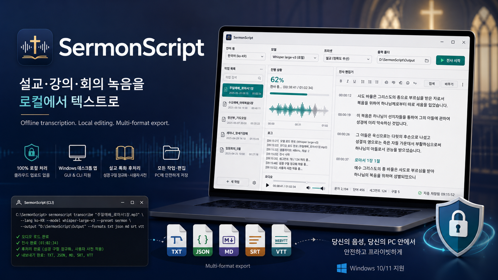

# SermonScript



**설교·강의·회의 녹음을 내 PC 안에서 텍스트로 바꾸고, 검수·편집·출력까지 끝내는 로컬 우선 Windows 데스크톱 STT 도구입니다.**

[](https://github.com/jeiel85/sermon-script/actions/workflows/test.yml)
[](https://github.com/jeiel85/sermon-script/actions/workflows/build-windows.yml)
[](LICENSE)
[](pyproject.toml)

[공식 랜딩 페이지](https://jeiel85.github.io/sermon-script/) · [GitHub Releases](https://github.com/jeiel85/sermon-script/releases) · [사용자 가이드](docs/user-guide.md)

SermonScript는 목회자, 교회 미디어팀, 강사, 연구자가 긴 녹음 파일을 안전하게 텍스트화하도록 만든 오픈소스 앱입니다. 오디오와 변환 텍스트는 기본적으로 외부 서버로 전송되지 않으며, STT 원본(`raw_text`)은 보존하고 사용자의 수정은 `edited_text`로 분리해 저장합니다.

## 지금 가능한 일

| 영역 | 현재 지원 |
| --- | --- |
| 입력 | 로컬 오디오/비디오 파일: `mp3`, `wav`, `m4a`, `aac`, `flac`, `ogg`, `mp4` |
| 실행 방식 | Windows GUI(PySide6) + CLI, 같은 core/service 계층 재사용 |
| STT | faster-whisper 기반 변환, `tiny`부터 `large-v3`까지 모델 선택 |
| 전처리 | FFmpeg 16kHz mono WAV 변환, `none`, `stt_basic`, `sermon`, `noisy` 프리셋 |
| 편집 | 세그먼트별 타임스탬프 편집, 검색·치환, 확인 필요 표시, 교정 후보 적용/무시 |
| 설교 후처리 | 성경 구절 정규화, 사용자 사전, 원문 대조, 한국어 Jamo fuzzy 교정 후보 |
| Export | TXT, JSON, Markdown, SRT, VTT, CSV 동시 출력 |
| 저장 | SQLite 작업 이력, 세그먼트, export 기록, 원문 대조/교정 후보 보존 |
| 배포 | PyInstaller 기반 Windows Portable ZIP, 태그 기반 GitHub Release 자동화 |

## 빠른 시작

### 사전 준비

- Windows 10/11 권장
- Python 3.11 이상
- FFmpeg (`ffmpeg`와 `ffprobe`가 PATH에서 실행 가능해야 합니다)

### 설치

```powershell
git clone https://github.com/jeiel85/sermon-script.git
cd sermon-script
python -m venv .venv
.\.venv\Scripts\Activate.ps1
pip install -e ".[gui,reference,dev]"
```

`[gui]`는 PySide6, `[reference]`는 원문 대조 품질을 높이는 rapidfuzz, `[dev]`는 테스트와 린트 도구를 설치합니다.

### 환경 점검

```powershell
sermonscript doctor
```

Python 버전, OS, FFmpeg 설치, 앱 데이터 디렉터리 쓰기 권한을 한 번에 확인합니다.

## GUI 실행

```powershell
python -m sermonscript.app.main
```

파일을 추가하고 언어·모델·전처리 프리셋·출력 폴더를 고른 뒤 변환을 시작합니다. 변환은 worker thread에서 실행되어 UI가 멈추지 않고, 완료 후 편집기 탭에서 세그먼트별 텍스트와 교정 후보를 검수할 수 있습니다.

## CLI 변환

```powershell
sermonscript transcribe sermon.mp3 --language ko --model small --preset sermon `
  --format txt,json,md,srt,vtt,csv --output .\exports
```

설교 원문과 사용자 사전을 함께 쓰면 initial prompt와 교정 후보 생성에 활용됩니다.

```powershell
sermonscript transcribe sermon.mp3 --reference sermon.md --user-dict my-dict.json
```

교정 후보는 자동으로 원문을 덮어쓰지 않고 `pending` 상태로 저장됩니다.

```powershell
sermonscript corrections list <job-id>
sermonscript corrections apply <suggestion-id>
sermonscript corrections ignore <suggestion-id>
```

## 데이터와 프라이버시

- 원본 오디오 파일은 수정하지 않습니다.
- STT 원본 `raw_text`는 덮어쓰지 않습니다.
- 사용자가 수정한 텍스트는 `edited_text`에 저장합니다.
- 전처리 결과는 작업 캐시 또는 지정한 캐시 폴더에 별도 생성합니다.
- 모델 파일, 오디오 파일, 전체 설교 원문은 저장소에 커밋하지 않습니다.
- v1.0 범위에서는 YouTube URL, 온라인 다운로드, 클라우드 동기화, 외부 API 송신을 제공하지 않습니다.

Windows 기본 저장 위치:

- DB / 설정 / 모델 캐시: `%LOCALAPPDATA%\SermonScript\SermonScript\`
- 전처리 캐시: 작업 디렉터리 또는 `--cache-root` 아래 `cache/jobs/<job_id>/`
- DB 경로 확인: `sermonscript db-path`

## Windows Portable ZIP

릴리즈 태그(`v*`)를 푸시하면 GitHub Actions가 Windows Portable ZIP과 `SHA256SUMS.txt`를 생성해 GitHub Release에 첨부합니다. FFmpeg와 STT 모델은 기본 번들에 포함되지 않으며, 사용 환경에서 별도로 준비해야 합니다.

로컬 빌드:

```powershell
.\scripts\build_windows.ps1
```

## v1.0 범위 제외

다음 기능은 현재 릴리즈 범위에서 제외되어 있습니다.

- YouTube URL 입력 / 온라인 다운로드: [docs/deferred-youtube-import.md](docs/deferred-youtube-import.md)
- 클라우드 동기화 / 외부 API 송신
- 실시간 마이크 녹음
- 화자 분리
- 자동 요약
- 자동 업데이트 설치

## 문서

- 사용자 가이드: [docs/user-guide.md](docs/user-guide.md)
- 제품 명세: [docs/product-spec.md](docs/product-spec.md)
- 알려진 제한사항: [docs/known-limitations.md](docs/known-limitations.md)
- 릴리즈 체크리스트: [docs/release/release-checklist.md](docs/release/release-checklist.md)
- 로드맵: [docs/roadmap-tasks.md](docs/roadmap-tasks.md)
- 시스템 아키텍처: [docs/architecture/system-architecture.md](docs/architecture/system-architecture.md)
- 의사결정 기록: [docs/decision-log.md](docs/decision-log.md)

## 라이선스

- 본 프로젝트: Apache-2.0 ([LICENSE](LICENSE))
- 외부 의존성 고지: [THIRD_PARTY_NOTICES.md](THIRD_PARTY_NOTICES.md)
- 보안 신고: [SECURITY.md](SECURITY.md)
- 기여 가이드: [CONTRIBUTING.md](CONTRIBUTING.md)
