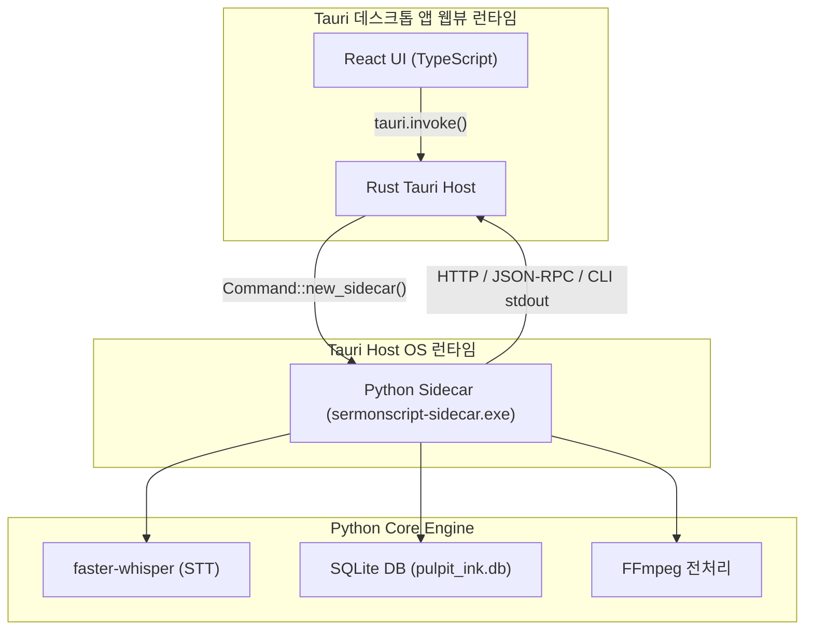

# Architecture Analysis: Tauri Hybrid Branch (`feat/tauri-hybrid`) 비교 분석 보고서

이 보고서는 현재 PySide6 기반의 데스크톱 애플리케이션 구조를 지닌 `main` 브랜치와 React + Tauri(Rust) 하이브리드 아키텍처를 실험한 `feat/tauri-hybrid` 브랜치 간의 기술적 차이, 장단점, 병합 충돌 요소 및 향후 아키텍처 전환 방향을 정밀 진단하기 위해 작성되었습니다.

---

## 1. 아키텍처 비교 개요

| 비교 항목 | 현재 `main` 브랜치 (PySide6) | `feat/tauri-hybrid` 브랜치 (React + Tauri + Sidecar) |
| :--- | :--- | :--- |
| **UI 프레임워크** | **PySide6 (Qt for Python)** | **React + TypeScript + Vite (HTML/CSS/JS)** |
| **백엔드/런타임** | Python 3.11+ 프로세스 내 직접 렌더링 | Rust (Tauri Host) + 웹뷰(WebView2) 렌더링 |
| **STT 및 Core 로직** | Python Core 직접 호출 (faster-whisper) | Python Sidecar (컴파일된 PyInstaller 단독 프로세스) 호출 |
| **IPC 통신 방식** | 프로세스 내 직접 메서드 호출 및 QThread | Tauri Command (`invoke`) ↔ Rust ↔ Python Sidecar (HTTP/JSON-RPC) |
| **패키징 및 배포** | PyInstaller 기반 단일 폴더/EXE 번들화 | Tauri Bundler (Rust EXE) + Python Sidecar EXE 결합 번들 |
| **설치 본체 용량** | Portable ZIP 약 170MB | Tauri EXE (~5MB) + Python Sidecar (~170MB) = 약 175MB |
| **메모리(RAM) 점유** | 약 150MB ~ 250MB (STT 미작동 시) | WebView 런타임 추가로 인해 약 200MB ~ 350MB 점유 |

---

## 2. 브랜치 주요 소스 변경 현황

`git diff main..feat/tauri-hybrid` 분석 결과, 총 **170개 파일 변경 (10,960 insertions, 4,699 deletions)**이라는 초대형 아키텍처 변경점이 발견되었습니다.

### A. 추가된 프론트엔드 리소스 (`frontend/`)
- **React + Vite 기반 개발 환경**: 
  - `frontend/package.json` 및 `package-lock.json` (Vite, React, TypeScript, Tauri API 등 의존성 정의)
  - `frontend/src/App.tsx` (1,116줄 규모): 과거 `sermonscript` GUI 메인 화면 및 텍스트 편집기 탭을 웹 프레임워크(TSX)로 전면 포팅한 프론트엔드 핵심 UI.
  - `frontend/src/App.css` (685줄 규모): 풍부한 웹 컴포넌트 스타일 시트.
- **Tauri Rust 호스트 (`frontend/src-tauri/`)**:
  - `frontend/src-tauri/Cargo.toml` 및 `Cargo.lock`: Rust 기반 Tauri 코어 런타임 의존성.
  - `frontend/src-tauri/src/lib.rs` (88줄 규모) 및 `main.rs`: Rust 단에서 Python 사이드카 프로세스를 기동하고, 프론트엔드 웹뷰와의 통신을 중재하는 명령어 바인딩.

### B. 파이썬 Core 패키지 역전 (브랜딩 리팩토링 누락)
- `feat/tauri-hybrid` 브랜치는 과거 **SermonScript** 브랜드명 하에 개발되던 중 갈라져 나갔습니다.
- 이에 따라 `src/pulpit_ink/` 패키지가 전부 지워지고 과거 `src/sermonscript/` 패키지 구조로 복원(Insert 1,000+ lines, Delete 1,000+ lines)되어 있습니다.
- `pyproject.toml`, Spec 파일들(`pulpit-ink.spec`, `pulpit-ink-sidecar.spec`), CLI 스크립트 등 모든 참조명이 과거 상태(`sermonscript`)로 돌아가 있어 `main`과 직접 병합 시 명칭 충돌로 인해 프로젝트 작동이 불가능합니다.

### C. 신규 기능 및 유닛 테스트의 결손
- `main` 브랜치에 v0.4.0 ~ v0.4.5에 걸쳐 추가된 수많은 명세가 `feat/tauri-hybrid`에는 없습니다:
  - `test_batch_queue.py` (다중 작업 배치 큐 테스트)
  - `test_diarizer.py` (Heuristic 화자 분리 테스트)
  - `test_i18n.py` (경량 영한 번역 테스트)
  - `test_youtube.py` (Disclaimer 및 yt-dlp 자동 진단 테스트)
  - `csv_exporter.py` 및 Inno Setup 설치 인프라 등
- `main` 브랜치 대비 최신 패치 및 버그 수정 사항이 완전히 유실되어 있습니다.

---

## 3. Tauri 하이브리드 아키텍처의 연동 흐름 (사이드카 모델)

Tauri 하이브리드 아키텍처는 Python 런타임을 브라우저나 Rust로 변환하는 것이 불가능하므로, Python Core 로직을 **사이드카(Sidecar)**로 분리하여 별도 백그라운드 프로세스로 띄웁니다. Rust 호스트가 이 프로세스를 관리하고, React UI는 Rust 호스트를 중재자로 거쳐 Python Core와 비동기 JSON 통신을 주고받는 3레이어 구조를 지닙니다.

---

## 4. 아키텍처별 트레이드오프 (Trade-off) 분석

### 🟢 PySide6 (main)의 강점
1. **극도의 개발 생산성**: 백엔드와 GUI가 동일한 Python 3.11+ 언어로 짜여 있어 통신 오버헤드나 복잡한 IPC 중재 없이 직접 메서드 호출 및 QThread 워커 연동이 가능합니다.
2. **코드 베이스 정합성**: 현재 `115/115 테스트`와 `ruff check`가 완벽하게 통과하며, 오류 추적과 릴리즈 자동화 파이프라인이 완전 구축되어 있습니다.
3. **단일 프로세스 구조**: 백그라운드에 불필요한 별도 포트 통신이나 사이드카 프로세스 기동 없이, 단일 파이썬 빌드본으로 완전한 안정성을 확보합니다.

### 🔴 PySide6 (main)의 약점
- **UI 스타일링의 복잡성**: Qt 스타일시트(QSS)는 최신 CSS3에 비해 작성 및 디버깅이 까다롭고, 애니메이션 효과나 모던 웹 컴포넌트(예: TailwindCSS, Glassmorphic 테마 등)를 적용하는 데 한계가 있습니다.

---

### 🟢 Tauri Hybrid (`feat/tauri-hybrid`)의 강점
1. **웹 생태계의 UI 극대화**: React, TailwindCSS, Framer Motion 등을 100% 활용할 수 있어 데스크톱 앱이라고 믿기 힘들 정도의 놀랍고 역동적인 UX/UI를 쉽게 구축할 수 있습니다.
2. **경량 호스트**: Electron 등과 비교했을 때 호스트 런타임(Rust)이 매우 작고 빠릅니다.

### 🔴 Tauri Hybrid (`feat/tauri-hybrid`)의 약점
1. **아키텍처의 비대화 및 통신 복잡성**: 간단한 텍스트 수정이나 데이터 쿼리조차 `React ↔ Rust IPC ↔ Python Sidecar HTTP ↔ SQLite`라는 복잡한 다단계 IPC 터널링을 거쳐야 하므로 오버헤드가 발생하고 디버깅이 매우 고통스럽습니다.
2. **패키징 극악의 난이도**: Windows 배포 시 Rust Tauri 빌드 프로세스와 Python PyInstaller Sidecar 빌드 프로세스가 이중으로 가동되어야 하며, 디스크 가상화 가드가 걸릴 경우 사이드카 기동 오류(Windows Defender 오탐) 등이 빈번히 보고됩니다.

---

## 5. 최종 병합 및 아키텍처 결정 방향성 추천

> [!CAUTION]
> **직접적인 Git Merge(병합)는 불허합니다.**
> `feat/tauri-hybrid` 브랜치는 파이썬 코어의 이름이 과거 `sermonscript` 상태이고 v0.4.0 이후의 대단위 기능(배치 큐, 화자 분리 등)이 전혀 탑재되지 않은 과거 분기점입니다. 직접 병합(merge)할 경우, 대규모 컴파일/임포트 에러 및 기능 유실이 100% 발생합니다.

### 💡 추천하는 점진적 접근 시나리오:
- **Phase A (단기: PySide6 기반 v1.0 정식 릴리즈 완료)**:
  - 현재 극도로 안정적인 `main` 브랜치(PySide6)의 안정성을 바탕으로 v1.0을 최종 출시합니다.
- **Phase B (중기: Tauri 하이브리드 아키텍처 전면 백업 및 격리 유지)**:
  - `feat/tauri-hybrid` 브랜치는 삭제하지 않고 `main`과 별개인 실험용 브랜치(`feat/tauri-hybrid`)로 계속 유지합니다.
- **Phase C (장기: 웹 기반 UI 마이그레이션이 절실히 필요한 경우)**:
  - 직접 병합이 아닌, `main` 브랜치의 최신 `pulpit_ink` 파이썬 코어 모듈 위에 FastPy/JSON-RPC 서버 계층을 추가하고, Tauri 웹 프론트엔드를 신규로 설계하는 **'Greenfield 리라이팅'** 방식을 취해야 합니다.
