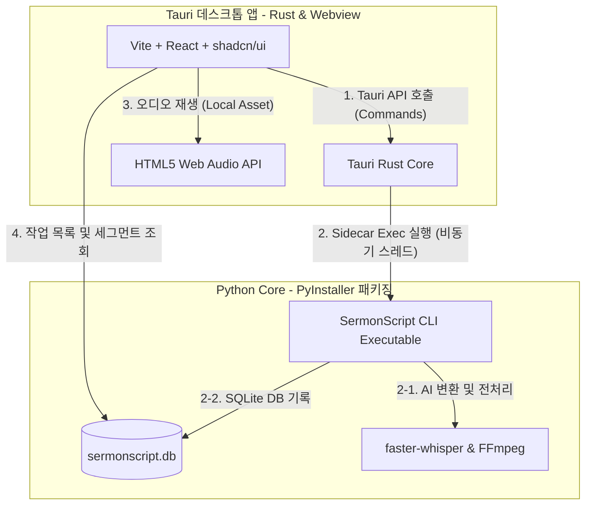
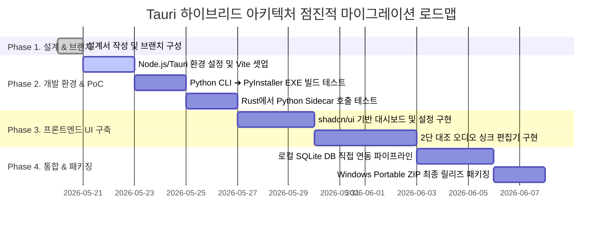

# Design: Tauri + Python Core 하이브리드 아키텍처 설계

이 문서는 SermonScript의 GUI를 기존의 PySide6(Qt)에서 초경량 모던 웹 기반 데스크톱 프레임워크인 **Tauri (React + Tailwind CSS + shadcn/ui)**로 피벗하고, 기존의 강력한 **Python Core(CLI/Services)** AI 엔진을 유기적으로 연동하기 위한 하이브리드 시스템 아키텍처 설계서입니다.

---

## 1. 아키텍처 개요 (High-Level Architecture)

전체 시스템은 **프론트엔드 UI 뷰어(Tauri)**와 **로컬 AI 백엔드 코어(Python CLI/Service)**가 분리되어 실행되는 **Sidecar & Async IPC 아키텍처**로 구성됩니다.



### 아키텍처의 3대 핵심 기둥
1. **Zero-Overhead UI (Tauri + OS Webview2)**: Chromium 브라우저를 내장하는 Electron과 달리, Windows 내장 Webview2를 사용하여 GUI의 메모리 소모를 20~30MB 수준으로 최소화합니다. 로컬 AI 모델(Whisper)이 구동될 CPU/GPU/RAM 자원을 100% 확보합니다.
2. **Sidecar Integration (PyInstaller Binary Bundle)**: 기존 Python Core 소스코드 전체를 수정하지 않고 그대로 `PyInstaller`를 사용해 단일 실행 파일(EXE)로 컴파일한 뒤, Tauri의 `Sidecar` 기능으로 앱 패키지에 포함시킵니다.
3. **Database-Centric State Management**: UI와 백엔드 CLI가 복잡한 실시간 RPC 메시지를 주고받는 대신, **SQLite Local Database**를 Single Source of Truth(단일 진실 공급원)로 삼습니다. UI는 DB를 직접 읽거나 Tauri Rust Core를 거쳐 가져오고, Python Sidecar는 작업을 수행하면서 DB를 갱신합니다.

---

## 2. 데이터 흐름 및 통신 인터페이스 (IPC/Data Flow)

### 2.1 STT 변환 요청 파이프라인 (비동기 백그라운드 작업)
GUI에서 새로운 오디오 파일을 변환할 때의 전체 흐름입니다.

1. **사용자 액션**: 사용자가 UI에서 오디오 파일을 드래그 앤 드롭하고 [변환 시작]을 클릭합니다.
2. **Tauri Command 트리거**: React UI가 Tauri Rust backend로 `run_transcription_job` 명령을 전송합니다.
   ```typescript
   import { invoke } from '@tauri-apps/api/core';
   
   // 비동기 호출
   invoke('run_transcription_job', { 
     filePath: "D:/sermons/audio.mp3", 
     language: "ko", 
     model: "small", 
     preset: "sermon",
     fuzzyMatching: true,
     fuzzyThreshold: 0.75
   });
   ```
3. **Sidecar 비동기 실행 (Rust ➔ Python CLI)**:
   Tauri Rust backend가 `tauri::webview::plugin::shell` 라이브러리를 활용해 Sidecar로 등록된 Python CLI 실행 파일을 비동기 스레드에서 백그라운드로 실행합니다.
   * **실행 명령**:
     `sermonscript-sidecar.exe transcribe "D:/sermons/audio.mp3" --language ko --model small --preset sermon --fuzzy-threshold 0.75`
4. **실시간 진행률 및 DB 동기화**:
   * Python CLI는 작동하면서 작업 상태(`status='processing'`, `progress=30%` 등)를 로컬 SQLite DB(`sermonscript.db`)에 즉시 기록합니다.
   * Tauri UI는 React Query 또는 단순 Interval Polling(예: 1초 주기)으로 DB 상태를 읽어 화면의 프로그레스 바를 갱신합니다.
   * 작업 완료 시, Python CLI가 `status='completed'`로 변경하고 세그먼트 및 Export 결과 저장을 마칩니다. UI는 이를 감지하고 미리보기 창에 텍스트를 로드합니다.

### 2.2 로컬 미디어 서빙 (Local Asset Protocol)
웹뷰 환경(Tauri)에서 로컬 PC의 대용량 오디오/비디오 파일을 브라우저 오디오 플레이어로 로드하려면 보안상의 제약(CORS)이 발생합니다.
* **해결책**: Tauri의 `custom protocol` 기능(`tauri-server://` 또는 `asset://`)을 활성화하여 로컬 오디오 파일을 스트리밍하고, HTML5 `<audio>` 태그와 `Wavesurfer.js`가 오디오 리소스에 직접 액세스할 수 있도록 처리합니다.

---

## 3. UI/UX 디자인 사양 및 핵심 킬러 기능

### 3.1 2단 대조 검수 편집기 (Split-View Editor)
투박했던 테이블 형식의 PySide6 편집기 대신, 웹 기술을 활용해 극도로 생산성이 뛰어난 대조 검수 인터페이스를 제공합니다.

* **좌측 탭 (원본 오디오 파형 + 세그먼트 타임라인)**:
  * 오디오 파형이 실시간으로 렌더링되며, 현재 재생 위치가 파형 위에 하이라이트됩니다.
  * 타임스탬프를 더블 클릭하면 오디오가 0.1초 오차 없이 해당 지점으로 자동 점프 재생(Audio-Sync)됩니다.
* **우측 탭 (원문 대조 및 교정 제안 영역)**:
  * STT 결과와 사용자가 업로드한 설교 원문(TXT/MD)이 줄바꿈 단위로 매핑되어 표시됩니다.
  * **Fuzzy 매칭 교정 팝오버**: 오탈자가 의심되는 텍스트(예: "이에수") 아래에 붉은 밑줄이 가며, 마우스를 올리면 자모 Fuzzy 엔진이 찾아낸 추천 단어("예수" (유사도 92%)) 팝오버가 등장합니다. 사용자는 클릭 한 번으로 간편하게 수정본(`edited_text`)에 반영할 수 있습니다.

### 3.2 디자인 테마 및 미적 완성도
* **Stack**: Tailwind CSS + **shadcn/ui** (Radix UI 기반) + Lucide Icons
* **Aesthetics**:
  * **다크 모드 기본 지원**: 밤샘 설교 편집이 잦은 미디어 담당 사역자들을 위해 슬릭하고 차분한 Slate/Zinc 톤의 다크 모드를 완벽하게 지원합니다.
  * **유리 질감(Glassmorphism)**: 앱 사이드바 및 헤더 영역에 미세한 불투명 배경(`backdrop-blur`) 효과와 미세 테두리 보더를 입혀 윈도우 11 환경과 완벽히 융합되는 프리미엄 디자인을 구현합니다.
  * **마이크로 애니메이션**: 변환 시작 시 버튼에 흐르는듯한 그라데이션 애니메이션 효과와 파일 드래그 앤 드롭 영역의 반응형 바운스 효과를 추가해 앱이 "살아 움직이는" 느낌을 극대화합니다.

---

## 4. 디렉터리 구조 설계 (Directory Layout)

전체 프로젝트는 기존 구조를 보존하면서 Tauri 소스 코드를 하위 경로에 담는 깔끔한 형태로 구성됩니다.

```text
sermon-script/
├── docs/                     # 기존 문서 및 신규 설계서
│   └── design/
│       └── tauri-hybrid-architecture.md
├── src/                      # [보존] 기존 Python Core 소스코드
│   └── sermonscript/
│       ├── core/             # AI STT, Jamo Fuzzy, 전처리 엔진
│       ├── cli/              # Typer CLI
│       └── storage/          # SQLite DB 연동 코드
├── src-tauri/                # [NEW] Tauri Rust 프로젝트 설정 및 래퍼
│   ├── Cargo.toml            # Rust 의존성 및 Sidecar 설정
│   ├── tauri.conf.json       # Tauri 빌드 및 권한 제어 설정
│   └── src/
│       └── main.rs           # Python Sidecar 실행을 관장하는 Rust 엔트리
├── frontend/                 # [NEW] Vite + React + shadcn/ui 웹 UI 소스
│   ├── src/
│   │   ├── components/       # split-view editor, progress, settings 컴포넌트
│   │   ├── hooks/            # DB 동기화를 위한 custom hooks
│   │   └── App.tsx           # 메인 애플리케이션 엔트리
│   ├── package.json          # Node.js 의존성 (Vite, React, Tailwind)
│   ├── tailwind.config.js    # 테마 설정
│   └── vite.config.ts        # Vite 빌드 설정
├── pyproject.toml            # [보존] Python 의존성 및 CLI 패키징 정보
└── requirements.txt          # [보존] Python 의존성
```

---

## 5. 단계적 마이그레이션 로드맵 (Migration Roadmap)



---

## 6. 결론 및 기대 성과

본 하이브리드 아키텍처 전환은 단순한 UI 디자인 스킨 입히기를 넘어, **SermonScript의 핵심 가치(Local-first, AI-driven, User-centric editor)를 세계적인 상용 수준으로 끌어올리는 강력한 릴리즈 파이프라인**이 될 것입니다.

- **성능 측면**: 파이썬 가상환경 오버헤드와 PySide6의 무거운 리소스 점유를 해소하여 오직 Whisper AI STT 구동에만 최적의 하드웨어 리소스를 사용합니다.
- **제품 경쟁력**: 복잡한 타임스탬프 세그먼트를 0.1초 단위의 오디오 파형과 동기화하여 초고속으로 수정할 수 있는 독보적인 '대조 검수 UI'를 확보하게 됩니다.
