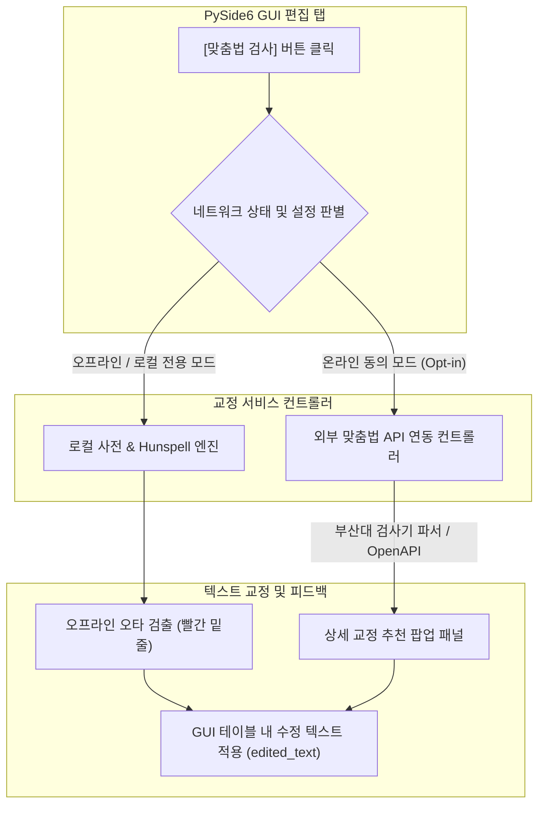

# Product Design: PulpitInk v1.0+ 신규 기능 확장 설계서 (v0.4.6)

이 설계서는 PulpitInk v1.0 정식 릴리즈 이후, 데스크톱 사용자의 검수 생산성을 획기적으로 개선하기 위해 기획된 **(1) 맞춤법 및 문맥 교정기 연동**과 **(2) Word .docx 정식 문서 직접 출력 엔진**의 핵심 아키텍처와 제품 스펙을 정의합니다.

---

## 1. 맞춤법 및 문맥 교정기 연동 아키텍처

데스크톱 사용자가 STT 결과를 최종 정제할 때 맞춤법 및 띄어쓰기 교정은 작업 시간의 70%를 차지합니다. 이를 자동화하기 위해 **"로컬 우선(Local First)"** 원칙을 고수하되, 사용자의 선택에 따라 정교한 온라인 분석이 가능하도록 **하이브리드 맞춤법 아키텍처**를 설계합니다.



### A. 로컬 오프라인 (Offline-first) 모드
- **정의**: 외부 인터넷 연결 없이 설교자의 원고 내용이 유출되지 않도록 로컬 PC에서 즉시 맞춤법 및 띄어쓰기 오류를 경고하는 보수적 모드.
- **기술적 세부**:
  - `PySide6.QtGui.QSyntaxHighlighter`를 활용하여 세그먼트 텍스트 영역 내 오류 의심 단어 아래에 빨간 꼬불꼬불 밑줄을 실시간 표시.
  - 한글 맞춤법 사전(`pyko-spacing` 또는 경량 `hunspell-ko` 오픈소스 사전) 빌드본을 Python Core 패키지에 번들링하여 로컬 서브스레드에서 동작.

### B. 온라인 정밀 교정 (Opt-in Online) 모드
- **정의**: 사용자가 개인정보 고지 및 온라인 연결에 동의한 경우, 전문 한국어 문법 교정기 파서를 통해 실시간 교정 후보 및 교정 이유를 제공하는 모드.
- **기술적 세부**:
  - 한국어 맞춤법/문법 검사기 표준 파서 또는 신뢰성 있는 오픈 API 연동 클래스 구현.
  - 문맥적 오류(예: "예수그리스도" ↔ "예수 그리스도", 잘못된 조사 쓰임)를 교정 추천 팝업 창에 표시하고, 사용자가 [적용] 클릭 시 `edited_text`에 연쇄 반영.

---

## 2. Word .docx 정식 문서 직접 출력 엔진 설계

현재 PulpitInk가 지원하는 Text, Markdown, CSV, SRT, VTT 외에, 최종 정제본을 교회 주보, 강대상 강독 원고, 혹은 도서 출판물로 즉시 사용할 수 있도록 레이아웃 템플릿이 입혀진 **정식 MS Word (.docx) 내보내기 엔진**을 설계합니다.

### A. 기술 스택 및 연동 흐름
- **핵심 라이브러리**: `python-docx` 라이브러리를 채택하여 OS 의존성(MS Office 설치 여부) 없이 순수 파이썬 단독으로 완벽한 OpenXML 규격의 `.docx` 생성.
- **프로세스**: GUI 내 [내보내기] 탭에서 `.docx` 포맷 선택 → 템플릿 옵션(인쇄용/배포용/표 형식) 토글 → `DocxExporter` 파이프라인 가동.

### B. 3대 레이아웃 스타일 템플릿 명세

#### 🚀 템플릿 1: 강대 인쇄용 (Large Text Lecture)
- **대상**: 강단 또는 강대상 위에서 설교자/강사가 직접 눈으로 읽기 편하도록 가독성을 극대화한 양식.
- **스타일 스펙**:
  - **폰트**: 나눔명조 또는 KoPub 바탕체 (가독성이 우수한 명조 계열)
  - **본문 크기**: **13pt ~ 15pt** (큰 글씨)
  - **줄 간격**: **1.6 ~ 1.8** (충분한 간격)
  - **용지 여백**: 위/아래 30mm, 좌/우 25mm
  - **타임스탬프**: 생략하거나 문단 끝에 흐린 각주(Footnote)로 숨김 처리.

#### 🚀 템플릿 2: 주보 및 배포용 (Standard Handout)
- **대상**: 회중 배포, 블로그 게재, 주보 삽입 또는 텍스트 공유를 위한 표준 서식.
- **스타일 스펙**:
  - **폰트**: 맑은 고딕 또는 KoPub 돋움체
  - **본문 크기**: **10.5pt**
  - **줄 간격**: **1.3**
  - **타임스탬프**: 문단 시작 부분에 `[00:05:12]` 형태로 회색(RGB 128, 128, 128) 작게(8pt) 삽입하여 텍스트의 가시성을 저해하지 않음.
  - **화자 태그**: 화자 전환 시 **[화자 1]** 또는 **[설교자]**를 볼드 처리하여 단락 구분선과 함께 배치.

#### 🚀 템플릿 3: 표 형식 검수용 (Table Grid Review)
- **대상**: STT 세그먼트 데이터의 최종 아카이빙 및 상세 타임라인 수동 대조용 그리드 서식.
- **스타일 스펙**:
  - **구조**: Word 표준 표(Table) 삽입
  - **열 구성**: `번호` (5%), `시간` (15%), `화자` (15%), `변환 내용 (edited_text)` (65%)
  - **디자인**: 테이블 헤더 감청색 음영 적용, 행간 옅은 회색 격자 테두리선(Grid Line) 삽입.

---

## 3. 문서 최상단 '성경 구절 하이라이트' 템플릿 스펙

설교록의 정체성을 강화하기 위해, Core 파이프라인에서 추출된 성경 본문 참조 데이터(`reference_documents.bible_refs`)가 존재하는 경우, **문서 첫 페이지 상단에 세련된 성경 본문 하이라이트 박스**를 자동으로 구성합니다.

```text
+-------------------------------------------------------------+
|  [ 성경 본문 ]                                              |
|                                                             |
|  "오직 의인은 믿음으로 말미암아 살리라 함과 같으니라"       |
|                                           - 로마서 1장 17절 |
+-------------------------------------------------------------+
```

### 🎨 박스 스타일 스펙 (python-docx XML 조작):
- **배경색**: 옅은 미색 (RGB 248, 246, 240) 또는 연회색 (RGB 245, 245, 245) 테두리 음영 채우기
- **좌측 테두리선**: 두께 3pt의 짙은 네이비 블루 (RGB 30, 41, 59) 강조 막대 선 삽입 (Blockquote 효과)
- **정렬**: 좌우 여백을 본문 대비 1cm씩 줄이고, 안쪽 여백(Padding)을 12pt 이상 부여하여 정돈된 레이아웃 연출.

---

## 4. UI/UX 구현 시나리오 (GUI 통합)

- **설정 메뉴 연동**:
  - PySide6 GUI의 `MainWindow` 내 설정 패널에 **[문서 출력 스타일]** 콤보박스(강대용 / 배포용 / 표 형식) 배치.
  - **[로컬 맞춤법 하이라이트 활성화]** 토글 체크박스 배치.
- **실행 흐름**:
  - 사용자가 편집 창에서 텍스트 수정을 마치고 [Export]를 실행할 때, 사용자가 선택한 Word 템플릿 옵션이 `DocxExporter`에 전달되어 실시간으로 스타일링된 워드 문서가 1초 내에 지정된 출력 경로에 드롭됩니다.
